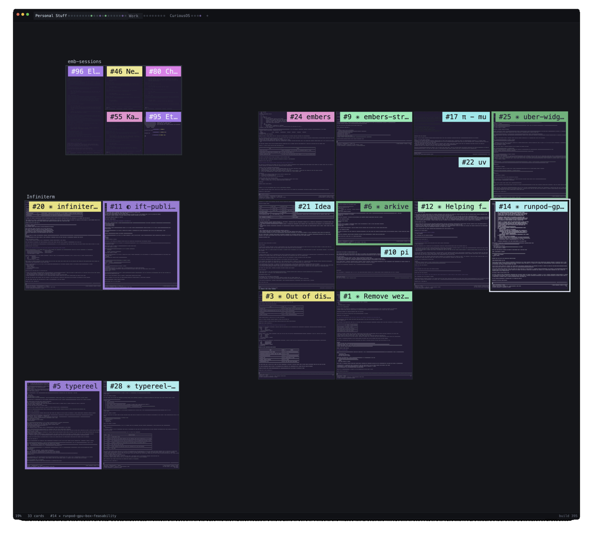

# infiniterm

Terminal cards on an infinite canvas, with the state of every coding agent visible at a glance.



## Setup

```sh
curl -fsSL https://infiniterm.app/install.sh | sh
```

Or with Homebrew:

```sh
brew install --cask ekinertac/tap/infiniterm
```

Or [download the DMG](https://github.com/ekinertac/infiniterm-releases/releases/latest). macOS 13 or later on Apple Silicon. Free for personal use; paid work needs a licence, $29 per person, one time. Docs at [infiniterm.app](https://infiniterm.app).

## What it is

It started as a way out of iTerm2: fifteen tabs with splits in each, and finding one session among thirty meant opening them one by one. Here every session is a card on one canvas and keeps its place. With coding agents in those cards, you also could not tell which were working, which were waiting on you and which had finished, so each card's border says it: violet working, yellow waiting on you, red failed, green done. Claude Code and Pi report through hooks; any zsh command reports too.

Nothing flashes, nothing steals focus, nothing sends a notification. You switch when you are ready.

- Terminal, editor, diff, transcript and browser cards on the same canvas, in groups and workspaces.
- Keyboard-first: `Cmd` is the app's, everything else goes to the shell untouched. Every action is a command in the palette.
- Shells outlive the window: each card's shell runs under its own small daemon, so quitting the app keeps your work running.
- `ift`, the command line side: `ift file.rs` edits a file over the terminal you are in, `ift diff` opens your changes, `ift attach 7` reaches card #7's shell from any terminal.

Native Rust: gpui draws the canvas, `alacritty_terminal` parses the shells, Chromium (CEF) runs the browser cards. No Electron, no account, no telemetry; the one request the app makes on its own is the update check. Early, and in active development.

## Building from source

Needs Rust, the CEF binary distribution under `~/.local/share/cef` and a checkout of [cef-rs](https://github.com/tauri-apps/cef-rs) at `~/Code/cef-rs` for its bundler.

```sh
make run          # build, bundle, launch on a scratch data dir
make check        # fmt, clippy, tests
make release      # optimised bundle in target/bundle/infiniterm.app
```

The app runs only from the bundle: the Chromium framework is loaded from beside the executable. See `CONTRIBUTING.md` before a pull request, and `CLAUDE.md` for how the code is laid out and why.

## License

Source-available, not open source. You can read, build and change it and run it on your own machines for free for personal use. Using it for work, freelance included, needs a licence, $29 per person. You cannot hand a build to anyone else; the official builds and the `ekinertac/tap` cask are the only ones. Full terms in `LICENSE.txt`.

The bundled `assets/fonts/SymbolsNerdFontMono-Regular.ttf` is from [Nerd Fonts](https://github.com/ryanoasis/nerd-fonts), MIT, licence beside it.
